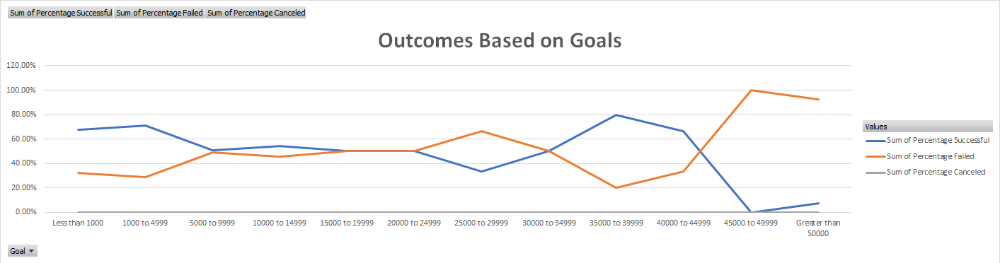

# Kickstarting with Excel

## Overview of Project
Using the Kickstarter dataset, we'll visualize campaign outcomes based on their launch dates and their funding goals.

### Purpose
Obtain insights on the best goals and dates for a successful play.

## Analysis and Challenges

### Analysis of Outcomes Based on Launch Date
In order to analyse the outcomes based on launch dates, a pivot table was created in the *Theater Outcomes on Launch Date*, where the data is filtered by the Parent Category *Theater*, the launch date's month is the first column and the rest are the counts of successful, live, failed and canceled plays. Using the previous information we obtain the following chart:

### Analysis of Outcomes Based on Goals
For the outcomes based on goals, a table was created in the *Outcomes Based on Goals*, where the count and percentage of successful, failed and canceled plays are grouped by a goal range. Using the previous information we obtain the following chart:

### Challenges and Difficulties Encountered
In the analysis of outcomes based on launch dates one challenge was encountered. When adding the *Date Created Conversion* column to the pivot table rows, it was automatically grouped by year, quartile and month, but the expected value was the short date. The explanation was in the group and ungroup button of the right click's menu.

During the analysis of the goals based outcomes, two challenges were overcome. First, there was some confusion on the criteria_range and criteria combination of the *COUNTIFS* formula. Second, on the pivot chart, the Y-axis was showing the decimal forat of the percentage and it was solved by changing the number format of the value field setting to percentage with two decimals.

## Results

- Conclusions on the Outcomes based on Launch Date:
1. When analysing the outcomes based on the launch month we can observe that the months of May and June have the largest number of successful theater funding events.
2. The month of December is the worst month to start a theater funding event since it has the lowest amount of successful events and they differ with the failed ones by only two events.

- Conclusions on the Outcomes based on Goals:
1. The highest success rate is in the *Less than 1000* range and it tends to go down. The *15000 to 19999* range is where the successful to failed plays rate is 50/50.
2. The ranges *35000 to 39999* and *40000 to 44999* have a bigger successful tha failed rate, but given the fact that there are very few shows in those ranges, the relevance of this information should be reviewed in detail.

- Limitations of this dataset
1. Currently it is the year 2020 and the latest information of the dataset is from 2017. Even though a lot of trends discovered could still be ongoing, the credibility of any insight obtained must be taken with skepticism.
2. As mentioned in the second point, for some goal ranges, there is not enough information to have a clear view of the full picture.
3. The dataset is missing information on the marketing campaign to promote the shows. It is important to know what was done in order to capture more backers, or how to target backers with a bigger average donation.
4. In order to compare the success between countries, we need a common currency.

- Other possible tables and/or graphs
1. When analysing the outcomes based on months, we should consider the rate of successful to failed and canceled fund raising campaigns, similar to what was done on the outcomes based on goals, since a larger number of successfull events does not necessarily mean that it is a better month for fundraising, it means that there were more campaigns.
2. A very useful chart would be based on the length of the fundraising event. A table similar to the outcome based on goals, but where the ranges are the days of the event's length and the chart should be a bar chart. A line chart gives the sense of continuity, but what we are actually plotting is the rate of successful to failed and canceled events over time length categories.
3. It would be interesting to investigate the influence that the *blurb* column has on the outcomes. Maybe there is a correlation between key words and outcome. The table's rows would be a dictionary of every word in the *blurb* column and the values would be  the amaunt of times that word appeared in a successful, failed and canceled event. A bar chart of the top ten words would give an interesting view of the importance on the *blurb* column.